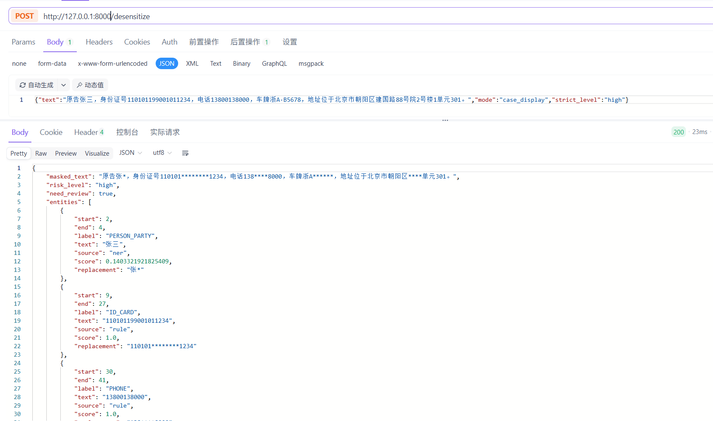

# Legal PII Redactor

中文法律文本脱敏工具，面向合同生成、案例展示、法律咨询记录和证据材料等场景。项目采用“规则引擎 + 法律 NER 小模型 + ONNX CPU 推理”的方式，目标是在本地 CPU 上实现秒级响应。


## 能做什么

- 规则识别：手机号、固定电话、身份证候选、邮箱、银行卡/银行账号、IP、URL、车牌、案号。
- NER 识别：当事人、证人、被害人、未成年人、代理人、律师、法官、地址、机构、律所、健康信息、商业秘密、合同项目。
- 脱敏输出：返回脱敏文本、命中实体、风险等级和是否需要人工复核。
- 训练闭环：用 OpenAI-compatible 强模型生成合成训练数据，本地训练 NER，导出 ONNX，INT8 量化后用 FastAPI 服务推理。

## 效果预览



## 项目结构

```text
app/
  api.py              FastAPI 服务
  desensitizer.py     规则和 NER 编排
  masker.py           脱敏策略
  ner.py              ONNX NER 推理
  rules.py            规则识别
train/
  generate_synthetic.py  强模型生成训练数据
  validate_dataset.py    JSONL 数据校验
  train_ner.py           NER 训练
  export_onnx.py         导出 ONNX
  quantize_onnx.py       INT8 量化
config/
  llm.example.json       LLM 配置模板
data/examples/
  legal_ner.sample.jsonl 示例数据
tests/
```

## 0. 安装环境

推荐 Python 3.11。

Windows PowerShell:

```powershell
conda create --name legal-pii-redactor python=3.11
conda activate legal-pii-redactor

python -m pip install -r requirements.txt
python -m pip install -r requirements-ml.txt
python -m pytest tests -q
```

Linux/macOS Bash:

```bash
conda create --name legal-pii-redactor python=3.11
conda activate legal-pii-redactor

python -m pip install -r requirements.txt
python -m pip install -r requirements-ml.txt
python -m pytest tests -q
```

## 1. 先跑规则版服务

规则版不需要训练模型，适合先验证 API。

```bash
uvicorn app.api:app --host 127.0.0.1 --port 8000
```

Windows PowerShell 测试请求：

```powershell
$body = @{
  text = "原告张三，身份证号110101199001011234，电话13800138000，车牌浙A·B5678。"
  mode = "case_display"
  strict_level = "high"
} | ConvertTo-Json -Compress

Invoke-RestMethod -Method Post `
  -Uri "http://127.0.0.1:8000/desensitize" `
  -ContentType "application/json; charset=utf-8" `
  -Body $body
```

Linux/macOS Bash 测试请求：

```bash
curl -X POST "http://127.0.0.1:8000/desensitize" \
  -H "Content-Type: application/json; charset=utf-8" \
  -d '{"text":"原告张三，身份证号110101199001011234，电话13800138000，车牌浙A·B5678。","mode":"case_display","strict_level":"high"}'
```

## 2. 配置强模型

真实配置不能提交到 git。先复制模板。

Windows PowerShell:

```powershell
Copy-Item config/llm.example.json config/llm.json
```

Linux/macOS Bash:

```bash
cp config/llm.example.json config/llm.json
```

编辑 `config/llm.json`：

```json
{
  "base_url": "https://api.openai.com/v1",
  "api_key": "replace-with-your-api-key",
  "model": "replace-with-your-strong-model",
  "timeout": 600,
  "max_retries": 2,
  "retry_backoff": 2.0
}
```

Windows PowerShell:

```powershell
$env:LLM_BASE_URL="https://api.openai.com/v1"
$env:LLM_API_KEY="your-key"
$env:LLM_MODEL="your-model"
```

Linux/macOS Bash:

```bash
export LLM_BASE_URL="https://api.openai.com/v1"
export LLM_API_KEY="your-key"
export LLM_MODEL="your-model"
```

生成数据时会打印实际生效的 `base_url`、`model`、`timeout`、`max_retries`。如果配置为 `timeout: 600`，但错误日志显示 `elapsed` 约 180 秒就断开，通常是上游 API 网关或代理有更短的超时限制；这时优先减小 `--batch-size`，例如从 `20` 改为 `5` 或 `10`。

也可以在命令行临时覆盖。

Windows PowerShell:

```powershell
python -m train.generate_synthetic `
  --count 100 `
  --batch-size 10 `
  --mode case_display `
  --output data/generated/legal_ner.preview.jsonl `
  --timeout 600 `
  --max-retries 3 `
  --retry-backoff 2
```

Linux/macOS Bash:

```bash
python -m train.generate_synthetic \
  --count 100 \
  --batch-size 10 \
  --mode case_display \
  --output data/generated/legal_ner.preview.jsonl \
  --timeout 600 \
  --max-retries 3 \
  --retry-backoff 2
```

## 3. 生成训练数据

生成阶段让强模型只输出实体文本，不输出 `start/end`。程序会自动定位 offset、校验实体格式，并跳过坏样本。只有整份文件校验通过后才会写入正式 JSONL。

强模型输出格式：

```json
{"text":"原告张三，电话13800138000。","entities":[{"text":"张三","label":"PERSON_PARTY"},{"text":"13800138000","label":"PHONE"}]}
```

最终训练格式：

```json
{"text":"原告张三，电话13800138000。","entities":[{"start":2,"end":4,"label":"PERSON_PARTY"},{"start":7,"end":18,"label":"PHONE"}]}
```

推荐第一轮生成 1 万到 1.5 万条。

`--mode` 控制生成数据的场景侧重：

| mode | 用途 | 适合场景 |
|---|---|---|
| `case_display` | 法律案例展示数据 | 案情摘要、庭审记录、证据材料、裁判摘要、执行调解 |
| `contract_generation` | 合同生成数据 | 合同条款、履约往来、付款通知、补充协议、商业秘密 |
| `general_redaction` | 通用脱敏数据 | 客服、电商、物流、医疗、教育、招聘、金融、出行、物业、账号安全 |
| `mixed_redaction` | 法律 + 通用混合数据 | 正式训练推荐，用来避免模型只适应法律文本 |

如果模型要用于合同和案例展示，同时还要处理普通业务文本，推荐训练集里加入 `mixed_redaction` 或 `general_redaction` 数据。`general_redaction` 主要补通用场景短板，`mixed_redaction` 更适合作为主训练集的一部分。

Windows PowerShell:

```powershell
python -m train.generate_synthetic `
  --count 8000 `
  --batch-size 20 `
  --mode case_display `
  --output data/generated/legal_ner.train.jsonl `
  --max-batches 800

python -m train.generate_synthetic `
  --count 1000 `
  --batch-size 20 `
  --mode case_display `
  --output data/generated/legal_ner.dev.jsonl `
  --max-batches 120

python -m train.generate_synthetic `
  --count 1000 `
  --batch-size 20 `
  --mode case_display `
  --output data/generated/legal_ner.test.jsonl `
  --max-batches 120

python -m train.generate_synthetic `
  --count 5000 `
  --batch-size 20 `
  --mode contract_generation `
  --output data/generated/legal_ner.contract.jsonl `
  --max-batches 600
```

Linux/macOS Bash:

```bash
python -m train.generate_synthetic \
  --count 8000 \
  --batch-size 20 \
  --mode case_display \
  --output data/generated/legal_ner.train.jsonl \
  --max-batches 800

python -m train.generate_synthetic \
  --count 1000 \
  --batch-size 20 \
  --mode case_display \
  --output data/generated/legal_ner.dev.jsonl \
  --max-batches 120

python -m train.generate_synthetic \
  --count 1000 \
  --batch-size 20 \
  --mode case_display \
  --output data/generated/legal_ner.test.jsonl \
  --max-batches 120

python -m train.generate_synthetic \
  --count 5000 \
  --batch-size 20 \
  --mode contract_generation \
  --output data/generated/legal_ner.contract.jsonl \
  --max-batches 600
```

校验数据：

```bash
python -m train.validate_dataset data/generated/legal_ner.train.jsonl
python -m train.validate_dataset data/generated/legal_ner.dev.jsonl
python -m train.validate_dataset data/generated/legal_ner.test.jsonl
python -m train.validate_dataset data/generated/legal_ner.contract.jsonl
```

看到 `errors=0` 再训练。

## 4. 不同数据量的训练参数

| 数据量 | 目标 | 推荐 epochs | batch size | base model | 说明 |
|---:|---|---:|---:|---|---|
| 100-300 | 冒烟测试 | 3 | 16 | `uer/chinese_roberta_L-2_H-128` | 只验证流程，不看效果 |
| 1000-3000 | Demo | 8-12 | 16 | `uer/chinese_roberta_L-2_H-128` | 常见模板有一点效果 |
| 5000-10000 | 初步可用 | 10-15 | 16 | `uer/chinese_roberta_L-2_H-128` | 本地 CPU 友好，推荐起步 |
| 10000-50000 | 推荐训练 | 8-12 | 16/32 | `uer/chinese_roberta_L-2_H-128` | 合成数据覆盖更稳 |
| 50000+ | 进一步优化 | 5-10 | 32 | `hfl/chinese-macbert-base` 或小模型 | 有 GPU 时可换更强模型 |

如果模型训练后全预测 `O`，优先增加 epochs，例如从 3 提到 10 或 15。

也可以使用 `--preset auto`，脚本会在训练开始前根据训练集条数、base model 和设备推导 `epochs`、`batch-size`、`learning-rate`、`warmup-ratio`。如果同时传入 `--epochs`、`--batch-size`、`--learning-rate` 或 `--warmup-ratio`，手动值优先生效。

`--preset auto` 的大致规则：

| base model | 数据量 | epochs | batch size | learning rate |
|---|---:|---:|---:|---:|
| `uer/chinese_roberta_L-2_H-128` | 10000-50000 | 8 | GPU 32 / CPU 16 | `3e-5` |
| `uer/chinese_roberta_L-4_H-512` | 10000-50000 | 6 | GPU 16 / CPU 8 | `2e-5` |
| `uer/chinese_roberta_L-4_H-512` | 50000+ | 4 | GPU 16 / CPU 8 | `2e-5` |
| BERT/MacBERT base 类模型 | 50000+ | 3 | GPU 8 / CPU 4 | `2e-5` |

`--learning-rate` 是学习率，控制每一步参数更新幅度。值太大容易训练不稳定，值太小会学得慢。小模型通常可用 `3e-5`，`uer/chinese_roberta_L-4_H-512` 和 BERT/MacBERT base 类模型建议从 `2e-5` 开始。

`--warmup-ratio` 是学习率预热比例。比如 `--warmup-ratio 0.06` 表示前 6% 的训练 step 从较小学习率逐步升到目标学习率，后面再正常训练。较大模型建议 `0.05` 到 `0.1`，小模型可以用 `0` 到 `0.05`。

使用 `--preset auto` 时通常不用手动设置这两个参数；如果手动传入，手动值会覆盖自动推导值。

## 5. 训练 NER

合并训练集。

Windows PowerShell:

```powershell
Get-Content data/generated/legal_ner.train.jsonl, data/generated/legal_ner.contract.jsonl `
  | Set-Content -Encoding utf8 data/generated/legal_ner.mixed.train.jsonl

python -m train.validate_dataset data/generated/legal_ner.mixed.train.jsonl
```

Linux/macOS Bash:

```bash
cat data/generated/legal_ner.train.jsonl data/generated/legal_ner.contract.jsonl \
  > data/generated/legal_ner.mixed.train.jsonl

python -m train.validate_dataset data/generated/legal_ner.mixed.train.jsonl
```

训练 CPU 友好的小模型。

Windows PowerShell:

```powershell
python -m train.train_ner `
  --train-file data/generated/legal_ner.mixed.train.jsonl `
  --dev-file data/generated/legal_ner.dev.jsonl `
  --base-model uer/chinese_roberta_L-2_H-128 `
  --output-dir models/legal-ner-v1 `
  --epochs 10 `
  --batch-size 16 `
  --device auto
```

Linux/macOS Bash:

```bash
python -m train.train_ner \
  --train-file data/generated/legal_ner.mixed.train.jsonl \
  --dev-file data/generated/legal_ner.dev.jsonl \
  --base-model uer/chinese_roberta_L-2_H-128 \
  --output-dir models/legal-ner-v1 \
  --epochs 10 \
  --batch-size 16 \
  --device auto
```

如果有 NVIDIA GPU，先确认当前环境安装的是 CUDA 版 PyTorch。官方安装命令以 [PyTorch 安装页面](https://pytorch.org/get-started/locally/) 为准。

Windows PowerShell:

```powershell
conda activate desensitization-ai

python -m pip uninstall -y torch torchvision torchaudio
python -m pip install torch torchvision torchaudio --index-url https://download.pytorch.org/whl/cu128

python -c "import torch; print(torch.__version__); print(torch.cuda.is_available()); print(torch.cuda.get_device_name(0) if torch.cuda.is_available() else 'CPU')"
```

Linux Bash:

```bash
conda activate desensitization-ai

python -m pip uninstall -y torch torchvision torchaudio
python -m pip install torch torchvision torchaudio --index-url https://download.pytorch.org/whl/cu128

python -c "import torch; print(torch.__version__); print(torch.cuda.is_available()); print(torch.cuda.get_device_name(0) if torch.cuda.is_available() else 'CPU')"
```

看到 `True` 和显卡名称后，再用 `--device cuda` 训练。如果 CUDA 不可用，脚本会直接报错，不会静默退回 CPU。

GPU 训练较大但 CPU 推理仍友好的模型，推荐先用 `uer/chinese_roberta_L-4_H-512`：

```powershell
python -m train.train_ner `
  --train-file data/generated/legal_ner.mixed.train.jsonl `
  --dev-file data/generated/legal_ner.dev.jsonl `
  --base-model uer/chinese_roberta_L-4_H-512 `
  --output-dir models/legal-ner-roberta-l4-h512 `
  --preset auto `
  --device cuda
```

如果显存吃紧，可以覆盖 batch size：

```powershell
python -m train.train_ner `
  --train-file data/generated/legal_ner.mixed.train.jsonl `
  --dev-file data/generated/legal_ner.dev.jsonl `
  --base-model uer/chinese_roberta_L-4_H-512 `
  --output-dir models/legal-ner-roberta-l4-h512 `
  --preset auto `
  --batch-size 8 `
  --device cuda
```

GPU 训练小模型：

```powershell
python -m train.train_ner `
  --train-file data/generated/legal_ner.mixed.train.jsonl `
  --dev-file data/generated/legal_ner.dev.jsonl `
  --base-model uer/chinese_roberta_L-2_H-128 `
  --output-dir models/legal-ner-v1 `
  --epochs 10 `
  --batch-size 32 `
  --device cuda
```

如果显存足够，可尝试更强模型。

Windows PowerShell:

```powershell
python -m train.train_ner `
  --train-file data/generated/legal_ner.mixed.train.jsonl `
  --dev-file data/generated/legal_ner.dev.jsonl `
  --base-model hfl/chinese-macbert-base `
  --output-dir models/legal-ner-macbert `
  --epochs 5 `
  --batch-size 16 `
  --device cuda
```

Linux/macOS Bash:

```bash
python -m train.train_ner \
  --train-file data/generated/legal_ner.mixed.train.jsonl \
  --dev-file data/generated/legal_ner.dev.jsonl \
  --base-model hfl/chinese-macbert-base \
  --output-dir models/legal-ner-macbert \
  --epochs 5 \
  --batch-size 16 \
  --device cuda
```

## 6. 导出和量化

Windows PowerShell:

```powershell
python -m train.export_onnx `
  --model-dir models/legal-ner-v1 `
  --output models/legal-ner-v1-onnx

python -m train.quantize_onnx `
  --onnx-dir models/legal-ner-v1-onnx `
  --output-dir models/legal-ner-v1-onnx-int8
```

Linux/macOS Bash:

```bash
python -m train.export_onnx \
  --model-dir models/legal-ner-v1 \
  --output models/legal-ner-v1-onnx

python -m train.quantize_onnx \
  --onnx-dir models/legal-ner-v1-onnx \
  --output-dir models/legal-ner-v1-onnx-int8
```

导出时看到 `TracerWarning` 或量化时看到 preprocessing warning 通常不是失败。确认 `model.onnx` 存在即可。

## 7. 启用 NER 模型

Windows PowerShell:

```powershell
$env:NER_MODEL_DIR="models/legal-ner-v1-onnx-int8"
uvicorn app.api:app --host 127.0.0.1 --port 8000
```

Linux/macOS Bash:

```bash
export NER_MODEL_DIR="models/legal-ner-v1-onnx-int8"
uvicorn app.api:app --host 127.0.0.1 --port 8000
```

Windows PowerShell 测试：

```powershell
$body = @{
  text = "原告张三委托王律师处理案件，联系电话13800138000，住北京市朝阳区建国路88号。"
  mode = "case_display"
  strict_level = "high"
} | ConvertTo-Json -Compress

Invoke-RestMethod -Method Post `
  -Uri "http://127.0.0.1:8000/desensitize" `
  -ContentType "application/json; charset=utf-8" `
  -Body $body
```

Linux/macOS Bash 测试：

```bash
curl -X POST "http://127.0.0.1:8000/desensitize" \
  -H "Content-Type: application/json; charset=utf-8" \
  -d '{"text":"原告张三委托王律师处理案件，联系电话13800138000，住北京市朝阳区建国路88号。","mode":"case_display","strict_level":"high"}'
```

## 8. Docker 部署

Docker 镜像只安装 API 和 CPU 推理依赖，不把项目代码、私密配置、模型文件和生成数据打进镜像。运行容器时直接把当前项目目录挂载到 `/app`：

```text
宿主机项目目录  ->  容器 /app
config/        ->  /app/config
models/        ->  /app/models
data/          ->  /app/data
```

这样 `config/llm.json`、`models/`、`data/` 都保留在宿主机项目目录里，更新模型或配置不需要重新构建镜像。

模型目录至少应包含：

```text
model.onnx
config.json
tokenizer.json
tokenizer_config.json
special_tokens_map.json
vocab.txt
```

构建镜像：

```bash
docker build -t legal-pii-redactor:latest .
```

Dockerfile 默认使用清华 Debian apt 镜像和 PyPI 镜像源加速依赖安装：

```text
http://mirrors.tuna.tsinghua.edu.cn
https://pypi.tuna.tsinghua.edu.cn/simple
```

如果需要换成其他源，可以构建时覆盖：

Windows PowerShell:

```powershell
docker build `
  --build-arg APT_MIRROR=http://mirrors.aliyun.com `
  --build-arg PIP_INDEX_URL=https://mirrors.aliyun.com/pypi/simple `
  --build-arg PIP_TRUSTED_HOST=mirrors.aliyun.com `
  -t legal-pii-redactor:latest .
```

Linux/macOS Bash:

```bash
docker build \
  --build-arg APT_MIRROR=http://mirrors.aliyun.com \
  --build-arg PIP_INDEX_URL=https://mirrors.aliyun.com/pypi/simple \
  --build-arg PIP_TRUSTED_HOST=mirrors.aliyun.com \
  -t legal-pii-redactor:latest .
```

只跑规则版，不加载 NER 模型：

Windows PowerShell:

```powershell
$project = (Get-Location).Path

docker run --rm -p 8000:8000 `
  -v "${project}:/app" `
  legal-pii-redactor:latest
```

Linux/macOS Bash:

```bash
docker run --rm -p 8000:8000 \
  -v "$PWD:/app" \
  legal-pii-redactor:latest
```

加载 NER 模型部署。

Windows PowerShell:

```powershell
$project = (Get-Location).Path

docker run --rm -p 8000:8000 `
  -e NER_MODEL_DIR="/app/models/legal-ner-v1-onnx-int8" `
  -v "${project}:/app" `
  legal-pii-redactor:latest
```

Linux/macOS Bash:

```bash
docker run --rm -p 8000:8000 \
  -e NER_MODEL_DIR=/app/models/legal-ner-v1-onnx-int8 \
  -v "$PWD:/app" \
  legal-pii-redactor:latest
```

如果要进入容器检查配置或模型路径：

```bash
docker run --rm -it \
  -v "$PWD:/app" \
  legal-pii-redactor:latest sh
```

部署检查：

```bash
curl http://127.0.0.1:8000/health
```

更新代码、配置或模型：

由于容器挂载的是整个项目目录，普通代码、`config/llm.json`、`models/`、`data/` 的更新不需要重新构建镜像，只需要重启容器。服务进程启动后不会自动重新加载 Python 代码或 ONNX 模型。

```bash
docker restart <container_name_or_id>
```

如果容器是用 `--rm` 启动的，停止后重新执行 `docker run` 即可。

只有下面这些变化需要重新构建镜像：

```text
Dockerfile 改了
requirements.txt 改了
requirements-runtime.txt 改了
Python 版本或系统依赖改了
```

## 实体标签

```text
NAME, PERSON_PARTY, PERSON_VICTIM, PERSON_WITNESS, PERSON_MINOR, PERSON_AGENT,
LAWYER, JUDGE, ORG_PARTY, ORG_LAWFIRM, ADDRESS, ID_CARD, PHONE, EMAIL, IP, URL,
BANK_CARD, BANK_ACCOUNT, PLATE, HEALTH, BUSINESS_SECRET, CONTRACT_PROJECT
```


## 许可证

MIT License. 详见 [LICENSE](LICENSE)。
